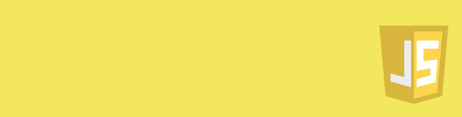
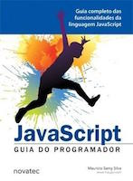
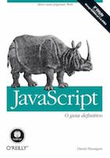
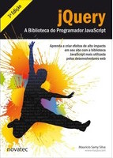
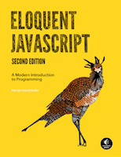

# LS

## Descrição

A disciplina de Linguagem de Script do Curso Superior de Tecnologia em Sistemas para Internet do IFPB tem como objetivo apresentar ao aluno conceitos sobre linguagens de script para processamentos de front-end. Sua carga horária apresenta um total de 50 horas aula e será ministrada pelo professor Luiz Carlos Chaves. Para as aulas serão utilizadas exposições e atividades práticas, além de avaliações individuais e em grupo.

> Esta discipilna possui como pré-requisito necessário o conhecimento prévio de Algoritmos, HTML e CSS.

## Conteúdo

Dentre os principais temas que serão abordados na disciplina pode-se listar:

* Introdução à Linguagem de Script
  * Fundamentos
  * Linguagem Javascript: Padrão ECMA, W3C e Biblioteca ou Frameworks
* Sintaxe Javascript
  * Introdução
  * Elementos básicos
  * Expressões
  * Sentenças
  * Funções
  * Objetos
* Objetos do Javascript
  * String, Number, Array
  * RegExp
  * Date
* Recursos do Navegador
  * Fundamentos
  * Eventos
  * Objetos do Browser
  * API DOM
  * HTML DOM
  * AJAX & Fetch API
* Frameworks
  * Fundamentos
  * Demonstração

Além disso, é possível visualizar os detalhes do [roteiro das aulas](docs/OUTLINE.md), das [ferramentas utilizadas](docs/TOOLS.md) e de alguns [links úteis](docs/RESOURCES.md).

## Avaliações

A nota final será computado através da média aritmética das avaliações e poderá ser adicionada atividades extras.

### Provas Prática
* Avaliação I: Sintaxe do JS e Objetos Nativos;
* Avaliação II: Objetos do W3C;
* Avaliação III: Blog

### Trabalho
* Projeto: [A especificação do projeto](assessment/projeto.md).

## Comunicação
Toda a comunicação será realizada usando o 

## Bibliografia

### Bibliografia Básica

 

### Bibliografia Complementar

 

E para completar ainda mais a listagem existe estes [exemplares](http://jsbooks.revolunet.com/) como outros indicações.
