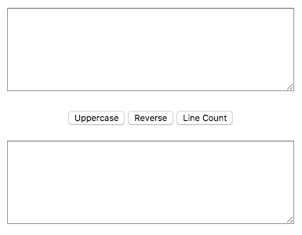
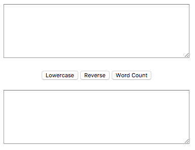
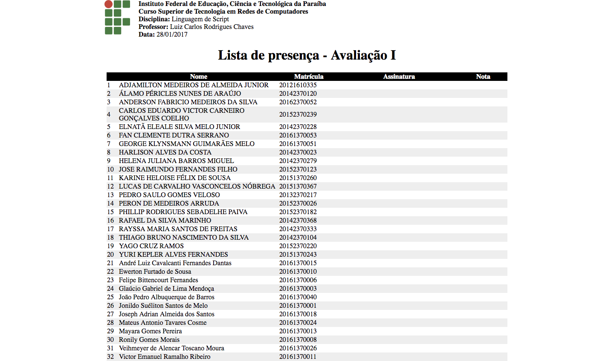
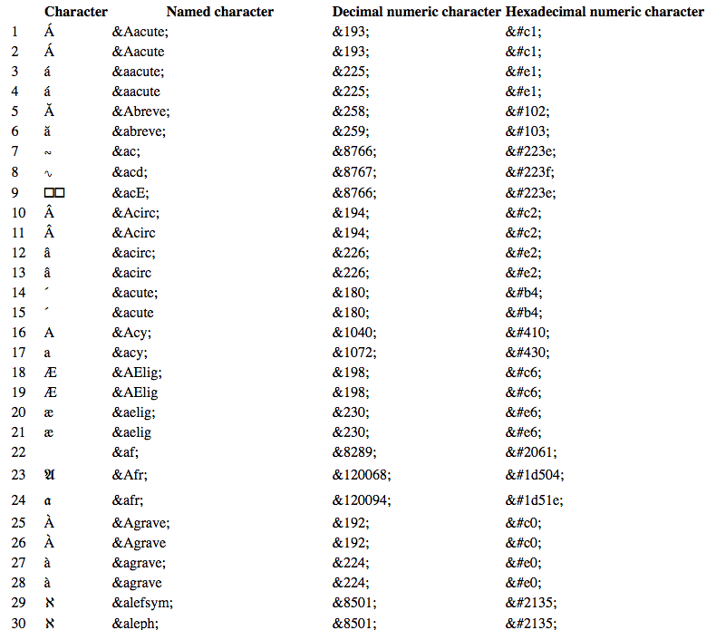

# Prova LS I - ECMA

### OBSERVAÇÕES

Leia as observações a seguir:

* A avaliação será realizada no computador, porém individualmente e em silêncio. Não deve haver nenhum tipo de comunicação entre os alunos;
* Cada questão é expresso através deste formato **QUESTÃO N (O DD%)**, no qual o `N`é o número da questão, o `O` significa que o aluno sentado na cadeira ímpar irá fazer essa questão, e `DD%` informa o critério de pontuação, contudo, a desorganização pode penalizar a pontuação final;
* No arquivo de resposta inclua um bloco de comentário no início de seu conteúdo com o nome e a matrícula do aluno;
* Ao concluir as questões chame o professor para avaliar a prova;
* Depois da avaliação envie os arquivos num diretório compactado, seguindo o formato de nome **&lt;ALUNO-MATRICULA&gt;** para o email **lucachaves+avaliacoesls20162@gmail.com** com:

> **Assunto:** [IFPB] Prova I LS

> **Conteúdo:** Os arquivos da prova do aluno < nome do aluno > (< matrícula >) estão em anexo.

### DESCRIÇÃO DA PROVA

A prova consiste de 4 questões que serão detalhadas a seguir, no qual os recursos necessários para algumas questões serão disponibilizados através deste [link](https://github.com/ifpb/ls/blob/master/assessment/prova-ecma/code.zip).

Por exemplo, a **QUESTÃO 3** precisa manipular sober alguns dados e renderizar uma imagem. Então as duas exigências estão disponíveis no link anterior, respectivamente nos arquivos `code/ls20162.json` e `code/ifpb.svg`.

### QUESTÕES

**QUESTÃO 1 (O 33%) -** Para auxiliar o tratamento de texto foi idealizado a criação de uma interface conforme ilustra a Figura 1, em que a caixa de texto inicial serve para adicionar o texto a ser tratado, e os botões que ativam o processamento do texto capturado na caixa de texto inferiro para:

  * Maiúsculo, de `fulano\nifpb` exibiria `FULANO\nIFPB`;
  * Ordem invertida, de `FULANO\nIFPB` exibiria `BPFI\nONALUF`;
  * Contagem de linhas, de `fulano\nifpb` exibiria `2`.

*Figura 1 - Processamento de String 1.*

**QUESTÃO 2 (E 33%) -** Para auxiliar o tratamento de texto foi idealizado a criação de uma interface conforme ilustra a Figura 2, em que a caixa de texto inicial serve para adicionar o texto a ser tratado, e os botões que ativam o processamento do texto capturado na caixa de texto inferiro para:

  * Minúsculo, de `FULANO\nIFPB` exibiria `fulano\nifpb`;
  * Ordem invertida, de `FULANO\nIFPB` exibiria `BPFI\nONALUF`;
  * Contagem de palavras, de `fulano\nifpb` exibiria `2`.

*Figura 2 - Processamento de String 2.*

**QUESTÃO 3 (O, E 33%) -** Para ajudar o professor de LS na impressão do espelho da disciplina foi extraído de seu diário a lista dos alunos e os dados da avaliação para um arquivo json, o `code/ls20162.json`, que possui as informações dentro de uma variável. Então, através desta variável tente gerar uma página conforme a Figura 3.

*Figura 3 - Espelho da Prova de LS.*

**QUESTÃO 4 (O,E 33%) -** Ao comentar sobre entidades do HTML o professor de LS pensou numa forma de exibir todas as entidades numa tabela, de forma que os caracteres seriam exibidos em seu formato nominal, decimal e hexa. Nesse sentido, é solicitado que o arquivo  [entities.json](https://www.w3.org/TR/html5/entities.json) coletado da norma HTML 5 do W3C, e disponível em `code/entities.json`, seja exibido em uma tabela semelhante a Figura 4.

*Figura 4 - Tabela de Entidades do HTML.*

